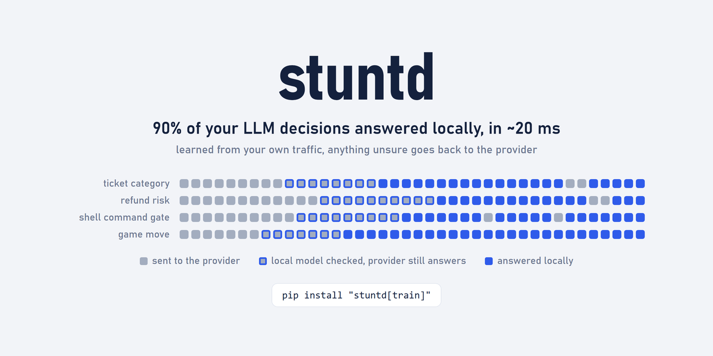
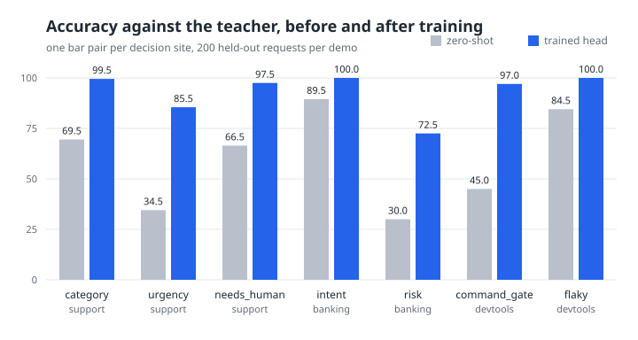
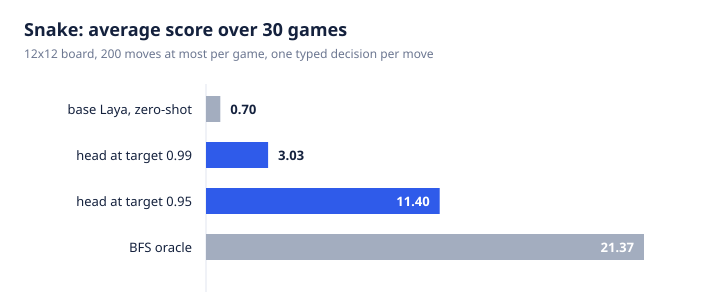
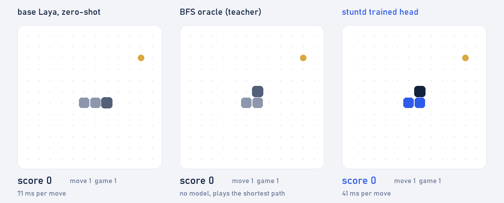

# stuntd: a local Jev-compatible proxy that learns your typed LLM decisions



[](https://github.com/bladedevoff/stuntd/actions/workflows/ci.yml)
[](https://pypi.org/project/stuntd/)
[](pyproject.toml)
[](LICENSE)
[](https://huggingface.co/spaces/pollix/stuntd)

**stuntd is a local, self-hosted proxy that records the typed decisions your app already makes and
learns to answer them itself.** It speaks the Jev System One protocol (`POST /v1/systemone`, with
`choice`, `score` and `noul` questions), the OpenAI Decisions API (`POST /v1/decisions`), the
OpenAI Chat Completions API and the Anthropic Messages API, distils each decision
site into a small head on a frozen [Laya](https://huggingface.co/convaiinnovations/laya) encoder
or a stock sentence encoder, and serves that answer locally with calibrated confidence, handing anything it is unsure about back
to the provider.

**Try it in the browser:** the [Hugging Face Space](https://huggingface.co/spaces/pollix/stuntd)
puts zero-shot Laya and the heads stuntd trained side by side on three demos, no install.

Three ways to run it:

- **Local Jev.** No key, no provider, no training. Point `typesafe-sdk` at stuntd and the base Laya
  checkpoint answers your typed questions.
- **In front of OpenAI or Anthropic.** A drop-in replacement for the provider base URL. Typed
  requests, Decisions API questions included, are recorded; everything else is relayed byte for
  byte.
- **In front of the paid Jev API.** stuntd relays, learns from the provider's own answers, and
  takes the decision over once its head is right often enough.

Status: early release, v0.2.0. Every number below traces to a demo in this repository or to a source
listed at the end.

## Who it is for

- **You have no Jev key.** TypeSafe's Jev is an early-access API at the time of writing, and there
  are no published weights. stuntd answers the same typed questions locally on Laya, with no key
  and no training, so a `typesafe-sdk` client keeps working while you wait.
- **You pay a provider for the same decision thousands of times a day.** Routing, triage,
  moderation, gating. stuntd distils those answers into a local head: tens of milliseconds, no
  tokens, no round trip.
- **Zero-shot Laya is not good enough on your labels.** On banking77's 77 intents it scores 38.2
  where Jev scores 76.4. A few thousand rows of your own traffic is what closes that gap: in the
  banking demo the risk question goes from 30.0% to 72.5%.
- **You want a Claude Code hook that decides locally.** A `PreToolUse` gate answering "may this
  command run" in about 50 ms, without sending every command you type to a provider.
  [`examples/devtools/`](examples/devtools/) ships the hook.

## Quickstart: local Jev without an API key

```
pip install "stuntd[train,jev]"
stuntd config init
stuntd serve
```

`config init` writes a commented `stuntd.toml` with everything at its default, which means no
OpenAI upstream and no Jev provider. `serve` lists the endpoints it serves and loads the base checkpoint:

```
stuntd listening on http://127.0.0.1:8787
endpoints: jev local
serving jev locally with convaiinnovations/laya
```

`stuntd stop` ends the daemon, and `GET /healthz` answers 200 with the number of sites in each
mode without loading a checkpoint.

Then change the base URL in your client and nothing else:

```python
from typesafe_sdk import Choice, Noul, TypeSafeClient

QUESTIONS = {
    "category": Choice(
        instructions="Which part of the product is this ticket about?",
        criteria={"billing": "Payments and refunds.", "bug": "Something is broken."},
    ),
    "needs_human": Noul(instructions="Does a support agent have to read this?"),
}

with TypeSafeClient(api_key="local", base_url="http://127.0.0.1:8787") as client:
    answer = client.system_one(
        state={"subject": "Charged twice", "body": "Two identical charges on Friday."},
        questions=QUESTIONS,
    )
print(answer.choices["category"].choice, answer.nouls["needs_human"].noul)
```

Anything that speaks the protocol plugs in the same way, by changing one base URL wherever the
client exposes it: `typesafe-sdk`, JevRouter, the local-server request of fast-jev-compaction, and
the browser and game agents built on the same SDK.

The key is ignored unless you set `[jev] require_key = true`. To train a head on this daemon you
need labelled rows: either put the paid Jev API in front of it (`[jev] upstream`) and let it teach,
or write the rows yourself and `stuntd import` them (see
[importing your own rows](#importing-your-own-rows)).

### Try it without any key

Nothing here needs an account, a provider or a training run: `pip install "stuntd[train,jev]"`,
`stuntd serve`, and run the client above. The first start downloads the Laya checkpoint (see
[Details worth knowing](#details-worth-knowing)).

To see how each answer was served, post the questions yourself and read the `X-Stuntd` header:

```
curl -si http://127.0.0.1:8787/v1/systemone -H "content-type: application/json" -d '{
  "state": "Charged twice for the same invoice",
  "model": "jev-latest",
  "questions": {"needs_human": {"type": "noul", "instructions": "Does a person have to read this?"}}
}'
```

With no head trained, the header reads `X-Stuntd: jev; mode=local; questions=1; live=0;
zeroshot=1`: the base checkpoint answered. The demos under [`examples/`](examples/) generate their
own labelled rows, so `stuntd import`, `stuntd train` and `stuntd enable` can be tried on data with
a known right answer before any of your own traffic is involved.

### The local fallback

In local Jev mode nothing sits behind the daemon, so a question a head will not answer has to be
answered by something. By default that is the base Laya, zero-shot: the head answers when its
confidence reaches the site's threshold and the request is not flagged by
[the novelty gate](#the-novelty-gate), and the base checkpoint answers the rest.
`serving.local_fallback = "head"` makes the head answer those too, for a head you trust more than
zero-shot on your labels. `stuntd enable` warns when a site's coverage is under 50% in local mode
with the zero-shot fallback, since most answers would then come from the base checkpoint.
`stuntd report SITE --gold FILE` scores what is actually served under whichever fallback is set,
and prints which one it used.

## Quickstart: OpenAI-compatible proxy that learns

```
pip install "stuntd[train]"
stuntd config init
stuntd serve --upstream https://api.openai.com
```

`--upstream` is the provider origin only, without `/v1`: your client's own path is appended to it
unchanged. In the client, point `base_url` at the daemon:

```python
import os

from openai import OpenAI

client = OpenAI(base_url="http://127.0.0.1:8787/v1", api_key=os.environ["OPENAI_API_KEY"])
```

Everything keeps working exactly as before. A request whose `response_format` (or single tool) asks
for an object made only of enum, boolean or number fields is a typed decision, and stuntd records
it with the provider's answer. Anything else is relayed untouched, streaming included.

An object with several fields, such as `{category, urgency, needs_human}`, learns one head per
field. Each field is its own site, named `<site>.<field>`, and a request is answered locally only
when every field's head is live and confident. If one is not, the provider answers and every field
is recorded.

Once a site has a few hundred captures:

```
stuntd status                  # what has been recorded, per site
stuntd train                   # one head per site with enough examples
stuntd report                  # holdout agreement, ECE, the operating point
stuntd enable <site>           # let that site answer locally
```

`enable` and `disable` also take the parent of a multi-field decision: `stuntd enable triage` acts
on every `triage.<field>` that has a head and prints each one. While some fields are not live, the
live ones are still compared against the provider's answer on every request, so their agreement
keeps moving and a field that drifts is demoted on its own.

## Quickstart: OpenAI Decisions API

OpenAI's Decisions API (`POST /v1/decisions`, model `gpt-6-luna`, public beta since 2026-10-06)
asks typed questions of a text: `predicate`, `choice` and `score`. stuntd learns them the way it
learns Jev questions: a predicate is a `noul`, a choice and a score keep their options, and every
question is a decision site named after its `name`.

Local, with no key. `stuntd serve` answers from a trained head where there is one and from
zero-shot Laya for the rest:

```
stuntd serve
```

```python
from openai import OpenAI

client = OpenAI(base_url="http://127.0.0.1:8787/v1", api_key="local")

decision = client.decisions.create(
    model="gpt-6-luna",
    input="Charged twice for the same invoice",
    questions=[
        {
            "type": "predicate",
            "name": "needs_human",
            "instructions": "Does a person have to read this?",
        },
        {
            "type": "choice",
            "name": "category",
            "instructions": "Which part of the product is this about?",
            "choices": [{"value": "billing"}, {"value": "bug"}],
        },
    ],
)
print([answer.type for answer in decision.answers])
```

In front of OpenAI, the same client with the real key and the daemon started with
`stuntd serve --upstream https://api.openai.com`. A request is answered locally only when every one
of its questions has a live head that is sure; otherwise it goes to OpenAI untouched and each
answer is recorded as the label of its question. Then `stuntd train`, `report` and `enable` work
exactly as for the other paths, and `X-Stuntd` carries the Jev-style header described
[below](#the-x-stuntd-header).

What stuntd does not learn is relayed whole in proxy mode and never breaks the caller: an
`input_image` part, a choice whose string and boolean values collide (`"true"` and `true`), a score
with more than 10 levels, duplicate names, an unknown question type, a choice with fewer than two
values, a message whose role is not `user`, a body that is not JSON, nests too deeply or carries a
lone UTF-16 surrogate. A refusal answer from the
provider is relayed and is not recorded as a label. In local mode the same requests get an
OpenAI-shaped 400 (`{"error": {"message": ..., "type": "invalid_request_error", ...}}`).

**Not measured against the live API.** The request and response shapes were checked against the
[Decisions guide](https://developers.openai.com/api/docs/guides/decisions) and the `openai` 3.27.0
SDK types, and the tests pin them with fixtures built from those shapes. Nothing here was run
against the real service.

## Quickstart: in front of Anthropic

```
pip install "stuntd[train]"
stuntd config init
stuntd serve --upstream https://api.anthropic.com
```

Point the SDK at the daemon; the key and the `anthropic-version` header are forwarded as they are:

```python
import anthropic

client = anthropic.Anthropic(base_url="http://127.0.0.1:8787")
```

A non-streaming `POST /v1/messages` that asks for a JSON schema through `output_config.format`, or
for a single tool with an `input_schema`, is a typed decision on the same terms as the OpenAI path.
The same decision asked through either provider lands on the same site and shares one head. A
streaming request, or a request with tools and a free-text reply, is relayed untouched. Claude
Code and the Agent SDK reach the daemon through `ANTHROPIC_BASE_URL`.

The local answer is checked against the `anthropic` SDK's `Message` model in the tests, but no live
Anthropic key has been run through stuntd.

## Numbers

What a trained head does, measured on a laptop RTX 5060 with `convaiinnovations/laya` as the base
checkpoint, 3000 generated rows per site and 24 epochs (5890 rows for Snake), with
`training.cache_encoder` at its default. "Zero-shot" is the same daemon before training, answering
from the base checkpoint alone.

| demo | questions | zero-shot | trained heads | answered locally | p50 per request |
| --- | --- | --- | --- | --- | --- |
| [Snake](examples/snake/) | 1 choice | 0.70 average score | 11.40 average score | 99.6% | 21.1 ms |
| [support](examples/support/) | choice, score, noul | 69.5 / 34.5 / 69.5% | 99.5 / 84.0 / 95.0% | 91% | 82.8 ms |
| [banking](examples/banking/) | 2 choice | 89.5 / 30.0% | 100.0 / 72.5% | 78% | 75.7 ms |
| [devtools](examples/devtools/) | choice, noul | 45.0 / 84.5% | 97.0 / 100.0% | 98% | 58.0 ms |

Every decision site of the three text demos, measured against its teacher on held-out requests
before and after the head was trained:



Snake is scored by what the answers do rather than by how many of them are right:



Five of the seven sites in the three text demos reach a holdout agreement of 0.95 or better. The
demos run at the default `target_agreement` of 0.99, which picks each head's operating point rather
than being a score it reached. The two that fall short, support's `urgency` at 0.922 and banking's
`risk` at 0.937, stay in the demos anyway: see [limitations](#limitations).

Latency, size and cost:

| | measured |
| --- | --- |
| one head answer on CUDA | p50 22 ms, 26 ms in process |
| the same head on CPU | 60 to 62 ms |
| one live answer through the daemon, over TCP | 28 ms |
| what the relay itself adds when the provider answers | 2.1 ms |
| Jev API round trip, through OpenRouter | p50 376 to 389 ms |
| Jev price | $0.042 per 1M input tokens, output free |
| training one head: 5890 rows, 24 epochs | 186 s |
| training three heads: 3000 rows each, 24 epochs | 266 s |
| a trained head on disk | about 50 MB, fp16 |

The first four rows were measured during development on an RTX 5060 laptop running Windows. They
come from no published benchmark, and there is no link to give for them. The two training rows are
the Snake and support demos of this repository, on the same laptop with the encoder cache on; the
devtools demo measured the same 24-epoch run at 730 s with the cache off against 231 s with it on,
3.2x.

Why train at all, rather than run Laya zero-shot. From
[jevbench](https://github.com/dhruvmehra/jevbench), n=500 per dataset, accuracy:

| dataset | labels | Laya zero-shot | Jev | fine-tuned DistilBERT |
| --- | --- | --- | --- | --- |
| sst2 | 2 | 92.0 | 95.4 | 91.0 |
| agnews | 4 | 90.6 | 84.3 | 91.0 |
| banking77 | 77 | 38.2 | 76.4 | 88.0 |

Zero-shot Laya holds its own at two or four labels and collapses at seventy-seven. A model trained
on a few thousand of your own examples does not: that is the bet stuntd makes, and the four demos
are what it is measured against.

### Laya against stock encoders

[`benchmarks/encoders.py`](benchmarks/) trains one site per encoder on a stratified sample of 3,000
training rows of MASSIVE intent (60 intents; ru, de, es, zh, ja, en) and Banking77 (77 intents), and
scores every row of the official test split. Accuracy of every answer, Laya at 24 epochs, the
others as `training.encoder`. The stock-encoder figures were identical in two full runs; Laya's
differ between runs, so its cell gives the lower and the higher:

| dataset | Laya (two runs) | multilingual-e5-base | multilingual-e5-small | all-MiniLM-L6-v2 |
| --- | --- | --- | --- | --- |
| MASSIVE ru | 26.2% to 27.2% | 81.6% | 78.6% | 54.7% |
| MASSIVE de | 29.5% to 31.5% | 79.6% | 75.9% | 65.1% |
| MASSIVE es | 34.3% to 34.4% | 80.5% | 78.0% | 63.5% |
| MASSIVE zh | 42.7% to 44.1% | 79.8% | 78.3% | 40.2% |
| MASSIVE ja | 32.1% to 32.2% | 79.8% | 79.5% | 57.7% |
| MASSIVE en | 60.1% to 60.7% | 83.7% | 81.2% | 81.0% |
| Banking77 | 65.1% to 66.1% | 89.6% | 87.5% | 90.0% |

At each head's own threshold for 99% agreement, multilingual-e5-base answers 18.0% to 41.9% of the
MASSIVE test rows locally, at 97.9% to 99.3% accuracy, and 60.8% of Banking77's; across the two
runs Laya answers 0.0% to 5.9% of the MASSIVE rows and 4.9% to 6.5% of Banking77's. Training a
stock head took 3.2 to 8.7 s on MASSIVE, Laya 236.4 to 308.7 s, and 1,768.8 to 1,860.3 s on
Banking77, where the encoder cache did not fit the 2,048 MB budget. One batch-1 decision on the CPU
has a p50 of 14.0 to 26.6 ms with multilingual-e5-base on MASSIVE and 337.4 to 401.7 ms with Laya.
The latency and training-time columns did not reproduce within 25% on every row between the two
runs, so read them as an order of magnitude. The laptop, the versions, the dataset revisions and
both full tables with coverage, local share and p95 are in
[`benchmarks/README.md`](benchmarks/README.md).

## How stuntd distils decisions into a Laya head

```
   your app
      |
      v
  +-------------------------------------------------+
  |  stuntd                                          |
  |                                                  |
  |   typed decision?  -- no --------------------------->  provider, byte for byte
  |         |                                        |
  |        yes                                       |
  |         v                                        |
  |   head confident?  -- yes -->  local answer      |     20 to 100 ms, no tokens
  |         |                                        |
  |         no, or a 2% check sample                 |
  +---------|----------------------------------------+
            v
        provider  (answer returned to the caller, and recorded as a capture)
```

A **decision site** is one place in your code that makes one decision. On the Jev path the site is
the question's name. On the OpenAI and Anthropic paths it is a hash of the response schema and the system prompt,
or whatever you put in the `X-Stuntd-Site` request header. A request with several typed fields
gives each field its own site, `<site>.<field>`.

Keep one decision to a question. A question that mixes two, such as "is it urgent and which team
handles it", learns worse than two separate questions. On the OpenAI and Anthropic paths, put the
two decisions in two fields of one object instead: each gets its own head.

Each site walks through four modes.

1. **collect.** The provider answers everything. stuntd stores the request text and the answer,
   with the redaction rules applied before anything is written.
2. **train.** `stuntd train` fits one classification head per site on the frozen Laya encoder,
   holds back 20% of the rows, and reports the holdout agreement, the calibration error and the
   confidence threshold at which the head reaches your `target_agreement`:
   `category  trained  holdout agreement 0.992  coverage 1.00 at agreement 0.992  ece 0.024`.
   Below that threshold the head abstains, which is what coverage measures: the share of requests
   it is willing to answer at all. `stuntd enable` refuses a head whose coverage rounds to zero and
   warns below 10%.
3. **shadow.** The caller still gets the provider's answer; the head answers beside it and the two
   are compared. `stuntd status` shows the running agreement.
4. **live.** `stuntd enable <site>` and the head answers the caller. Anything under the threshold
   still goes to the provider. So does a `check_share` sample, 2% by default, and those samples are
   what keeps the head honest: once agreement over the last `window` decisions falls below
   `target_agreement`, the site demotes itself back to shadow and logs why. Promotion the other way
   is manual unless you set `serving.auto_promote`.

With `serving.auto_promote` and `training.auto_retrain` both set, the loop closes: collect, train,
shadow, promote, demote, and retrain once `auto_retrain` new distinct texts have arrived since the
head was trained, on the OpenAI path and the Jev path alike. A text recorded again does not count
twice, and no run for a site starts sooner than `training.auto_retrain_min_minutes` (30 by default)
after the previous one for that site. The daemon runs `stuntd train` for the site as a child
process, one at a time, and the new head starts in shadow like any other, even when the site was
live before: the daemon logs that at warning level and `stuntd status` shows `shadow (retrained, was
live)`. A failed run is logged with its exit code and is not retried until another `auto_retrain`
distinct texts arrive; serving carries on meanwhile. `stuntd status` shows how the last automatic
run ended.

In proxy mode the provider behind `[jev] upstream` does not have to be the paid API. Any server
that speaks `POST /v1/systemone` can sit there -- kev, LLM2Jev, the laya-server family -- which
makes it a keyless local teacher: it answers, stuntd records, and the head learns from it. See
[Teachers](#teachers) for the four documented ones.

Nothing is uploaded. Captures live in a SQLite file under your user directory with private
permissions, and there is no telemetry.

### Checking a head against verified rows

Agreement measures how faithfully a head copies its teacher, the teacher's mistakes included. It
says nothing about whether either of them is right. For that, write a few hundred rows a person
has checked, in the same JSONL format `stuntd import` reads, and score the site against them:

```
stuntd report <site> --gold verified.jsonl
```

For example:

```
site tickets  gold rows 300: 296 used, 4 skipped
head accuracy 0.892
head accuracy 0.875 on 8 rows the store has not seen
served accuracy 0.936 at threshold 0.62: 71% answered locally, 3 below it with no teacher answer
teacher accuracy 0.948 on 288 rows
head and teacher: both right 252, both wrong 10, head only 5, teacher only 21
```

The head answers every row. The teacher's answer is the latest capture of that exact text, so it
is there only for rows stuntd has already seen, and those are rows the head may have trained on.
The line for rows the store has not seen is the out-of-sample number, so do not import the gold
rows or send them through the proxy before scoring. Served accuracy is what stuntd would serve
once the site is live: the head at or above the threshold, the teacher below it. Rows whose answer
is not one of the site's labels are skipped. `--json` prints the same numbers, and the command needs the train
extra, since it loads the base model.

### Reading `stuntd report`

```
site tickets  choice category  trained <time>  base convaiinnovations/laya
examples: <n> train, <n> holdout
holdout agreement 0.990 (95% interval <low>-<high>, <n> rows)  ece 0.011  temperature <t>
novelty cut-off <cut-off>, lets <share> of the holdout through
at threshold <t>: coverage <c>, agreement <a> (95% interval <low>-<high>, <n> rows)
```

Holdout agreement and the agreement at the operating point carry a 95% Wilson interval and the
number of rows they rest on. A holdout under 200 rows, or an operating point resting on fewer than
100 rows, prints a warning: the interval is then wide and the threshold may not hold on new
traffic.

Under the per-class table, "surest mistakes" lists the holdout rows the head got wrong with the
highest confidence. Each shows the confidence and the probability the head gave the answer it
chose, and is marked `(under the threshold)` when the head would not have served it. **Confidence
is not a probability.** It is 1 minus the normalised entropy of the head's distribution, a measure
of how peaked that distribution is, so the probability next to it, the head's own number for the
label it gave, can be lower.

### The novelty gate

A head is sure about what it has seen. Its confidence threshold comes from a holdout of the same
traffic, so it says nothing about a kind of request the head never saw.

The gate checks the request before the confidence. Training stores the pooled, normalised encoder
vector of every training row next to the head (`embeddings.safetensors`, 4.9 MB for the 2,400
training rows of a 3,000-row site) and the holdout's novelty at `training.novelty_quantile` as
`novelty_cutoff` in `meta.json`.
Novelty is 1 minus the mean cosine similarity to the 5 nearest training vectors. A request whose
novelty is above its site's cut-off is treated like a request under the confidence threshold: it
goes to the provider, is recorded as a capture, and the header says `reason=novel`. In local Jev
mode it follows [the local fallback](#the-local-fallback). `stuntd report` prints the cut-off and
the share of the holdout it lets through. Heads trained before 0.1.3 have no stored vectors and
serve as they did.

It ships on: `serving.novelty_gate = true` and `training.novelty_quantile = 0.99`. Measured on the
support demo ([`examples/support/`](examples/support/)), with each head's cut-off recomputed from
its own holdout at the quantile in the column header:

| | no gate | 0.95 | 0.98 | 0.99 |
| --- | --- | --- | --- | --- |
| templates left out of training, answered locally (heads on 15 templates) | 68.7% | 0.0% | 0.0% | 0.3% |
| all three right when answered locally | 42.4% | - | - | 100.0% (3 tickets) |
| new states of the 15 trained templates, answered locally | 88.8% | 78.2% | 83.2% | 85.8% |
| all three right when answered locally | 97.2% | 97.6% | 97.4% | 97.3% |
| new states, heads on all 20 templates, answered locally | 72.3% | 67.1% | 69.8% | 70.6% |
| all three right when answered locally | 97.2% | 97.6% | 97.3% | 97.2% |

The out-of-scope probes "what's the weather in Paris", `asdf qwer zxcv` and an empty state `{}` are
stopped at every quantile; without the gate no probe is stopped. At 0.99 the gate gives up 1.7
to 3.0 points of local share on familiar requests and lets 0.3% of the unseen kinds of ticket
through, where 0.95 stopped all of them at a cost of 5 to 11 points.
[`examples/support/check.py`](examples/support/check.py) reproduces every number in this section.

Each field gates on its own, and a request with several fields goes to the provider if any field
flags it, so the cost on familiar requests is larger than the share a single head's cut-off
leaves out. `training.novelty_quantile` is read when a head is trained, so retrain after changing
it; a head trained with 0.1.3 keeps the cut-off stored in its `meta.json`. Raising the quantile
answers more requests locally and stops fewer unseen kinds of input; lowering it does the
opposite. `serving.novelty_gate = false` turns the gate off, which lets unseen kinds of input
through to the heads again.

### Importing your own rows

`stuntd import SITE FILE` reads JSONL, one `{"text": ..., "answer": ...}` per line, and records
each row as a capture. The text has to be spelled the way the site will see its input when it
serves. For a Jev site that is the serialised state, as stuntd serialises it: a string state is
used as it is, and any other state is `json.dumps(state, ensure_ascii=False)`, with the keys in the
order the client sends them and the default separators.

```python
import json

state = {"subject": "Charged twice", "body": "Two charges on Friday."}
row = {"text": json.dumps(state, ensure_ascii=False), "answer": "billing"}
print(json.dumps(row, ensure_ascii=False))
```

For a chat site the text is the `user: ...` lines the store holds. The answer is always a string:
a label for a `choice` site (`--labels a,b,c`), `true` or `false` with `--kind boolean`, a number
for a number site. A `score` question is imported as a choice over its levels, so a 4-level score
takes `--labels 0,1,2,3`. A malformed row stops the import and nothing is written.

A row whose text and answer are already recorded for the site is skipped, and the command says how
many it skipped, so importing the same file twice is safe. `--dry-run` prints what would be
imported and skipped, and writes nothing.

### Removing and renaming sites

```
stuntd status                  # field sites are listed under their parent
stuntd site rename OLD NEW     # captures, decisions, model folder, plus an alias
stuntd site rm SITE            # asks first; --yes skips the question
```

`rename` moves a site's captures, decisions and model folder (the field sites of a multi-field
parent move with it) and records an alias, so requests whose computed site key is OLD keep landing
on NEW. `rm` deletes the same things and refuses while the site is live unless you pass `--force`.
Default site keys have not changed, so stores and heads from earlier versions keep working.

### `/healthz` and `stuntd stop`

`GET /healthz` answers 200 with `{"status": "ok", "learning": ..., "sites": {mode: count}}`
without loading a checkpoint, which makes it usable as a container health check. `stuntd serve`
writes a pid file under the data directory and `stuntd stop` ends that daemon; it exits 1 and says
so when none is running. `stuntd train` prints one line per epoch to stderr while it works.
`/healthz` counts a site by its recorded mode, so a site whose head was trained on another encoder
still counts as live there; `stuntd status` is where `encoder-mismatch` shows. `stuntd train` names
the encoder as "downloaded on first use" before it checks that a path exists.

### How many rows and how many epochs

These are the only measurements behind the advice: the demos in this repository, on one laptop,
with one encoder and rule-written teachers. Take them as a starting point.

- **Rows.** `training.min_examples` is 300, enough to train something and not enough to trust it;
  `report` warns under 200 holdout rows. The demos use 3,000 rows per site. On the hardest site of
  each, 1,500 rows at 24 epochs scored 0.643 (support `urgency`), 0.840 (banking `risk`) and 0.863
  (devtools `command_gate`); 3,000 rows scored 0.922, 0.937 and 0.985.
- **Epochs.** The default is 3, which is too few for anything but an easy site. At 1,500 rows
  `urgency` scored 0.323 at 3 epochs, 0.510 at 12 and 0.643 at 24; `risk` 0.367, 0.693 and 0.840;
  `command_gate` 0.473, 0.717 and 0.863. The demos set `training.epochs = 24`. With the encoder
  cache on, the default, the extra epochs cost seconds, because the frozen encoder runs once per
  site: three support sites at 3,000 rows and 24 epochs took 266 s.
- **Checking.** `stuntd report` gives the holdout agreement with its interval; prefer a site whose
  interval clears your target to one whose point estimate does. `stuntd report SITE --gold FILE`
  says whether the teacher itself was right.

### Stock sentence encoders

Laya is the default. `training.encoder` can instead name a stock sentence encoder, a Hugging Face
id or a local folder, and `stuntd train` then fits a linear head on its frozen, pooled vectors.
Three have a known input prefix; any other id uses the `query` prompt of its
`config_sentence_transformers.json`, or no prefix.

| `training.encoder` | size | licence | languages | prefix |
| --- | --- | --- | --- | --- |
| `laya` (default) | ModernBERT | Apache-2.0 | mostly English | none |
| `intfloat/multilingual-e5-base` | 278M | MIT | multilingual | `query: ` |
| `intfloat/multilingual-e5-small` | 118M | MIT | multilingual | `query: ` |
| `sentence-transformers/all-MiniLM-L6-v2` | 23M | Apache-2.0 | English | none |

Which to pick. The [benchmark](#laya-against-stock-encoders) has the numbers.

- **Laya** if you want the head and the zero-shot fallback to share one model. It is the only
  encoder that answers zero-shot, and the slowest to train and to run on a CPU.
- **multilingual-e5-base** for anything that is not English, or for many labels. It was the most
  accurate on every MASSIVE language and close to the best on Banking77.
- **multilingual-e5-small** when the CPU budget matters more than the last few points: about half
  the latency of the base model.
- **all-MiniLM-L6-v2** for English only, and the smallest and fastest head. On Banking77 and MASSIVE
  `en` it is close to the larger encoders; on the other languages it is not.

- **What is accepted.** The encoder is loaded with `trust_remote_code=False`. `config.json` is read
  first, and a `model_type` outside `bert`, `distilbert`, `roberta`, `xlm-roberta`, `mpnet` and
  `modernbert`, or an `auto_map` entry, stops `stuntd train` and `stuntd serve` with one line
  before any weights are fetched. Pooling follows `1_Pooling/config.json`, mean or CLS (mean when
  the file is absent); any other pooling is refused. The input is cut at `max_seq_length` from
  `sentence_bert_config.json`, else 512 tokens.
- **Zero-shot stays Laya.** A local Jev or Decisions request answers what no head answers from the
  Laya checkpoint, whatever `training.encoder` is, and a daemon that never needs zero-shot never
  loads Laya.
- **Epochs.** A stock encoder runs once per row and the head trains for a fixed 80 epochs on the
  stored vectors, so `training.epochs` does not apply. The count, the learning rate and the weight
  decay were chosen on the validation split of MASSIVE `en`, never its test split.
- **A head is served only by the encoder it was trained on.** `meta.json` records the encoder, and
  a head without that field is a Laya head, so 0.1.x heads serve unchanged. If `training.encoder`
  names a different encoder, the site is treated as if it had no live head: the provider answers
  in proxy mode, zero-shot Laya in local mode, `X-Stuntd` carries `reason=encoder-mismatch`,
  `stuntd status` shows `collect (encoder-mismatch)` and the daemon logs one warning per site.
- **Switching.** Change `training.encoder` in `stuntd.toml`, stop the daemon, run `stuntd train`,
  check the new head with `stuntd report`, `stuntd enable SITE`, and start the daemon again.
  Until a site is retrained it keeps the mismatch.

### The `X-Stuntd` header

Every answer says how it was served, so a silent fallback cannot hide.

On the OpenAI path: the mode, then the fields that apply.

```
X-Stuntd: live; site=moderation; confidence=0.97
X-Stuntd: collect; site=moderation; reason=low-confidence
X-Stuntd: passthrough; reason=no-schema
```

| field | values |
| --- | --- |
| mode | `live`, `shadow`, `collect`, `passthrough` |
| `site=` | the decision site this request landed on |
| `confidence=` | the head's calibrated confidence, two decimals, on a live answer |
| `reason=` | `no-schema`, `unsupported-schema`, `streaming`, `learning-off`, `no-upstream`, `low-confidence`, `novel`, `check`, `retrained`, `encoder-mismatch`, `model-error`, `no-runtime`, `state-error`, `upstream-error`; on a multi-field request `low-confidence:<field>`, `novel:<field>` and `not-live:<field>` name the field that kept it from being local |

On the Jev path: the mode it served in, then how the questions were answered.

```
X-Stuntd: jev; mode=local; questions=3; live=2; zeroshot=1
X-Stuntd: jev; mode=proxy; questions=2; live=0; shadow=1; check=0
X-Stuntd: jev; mode=local; questions=1; live=0; zeroshot=1; learn=off
X-Stuntd: jev; mode=local; reason=no-key
```

`POST /v1/decisions` answers with the same Jev-style header.

| field | values |
| --- | --- |
| `mode=` | `local` (no Jev provider behind it) or `proxy` (the paid API is) |
| `questions=` | how many questions the request asked |
| `live=` | answered by a trained head |
| `shadow=` | site in shadow mode, proxy mode only |
| `zeroshot=` | answered by the base checkpoint, local mode only |
| `check=` | sampled for a comparison with the provider, proxy mode only |
| `learn=off` | `learn = false`, so nothing was recorded |
| `reason=` | `no-key`, `bad-request`, `not-parsed`, `no-runtime`, `model-error`, `upstream-error`, `encoder-mismatch` |

## Teachers

In proxy mode `[jev] upstream` can be any server that speaks the System One request. These four
are documented as Jev-compatible; for each, `tests/test_teachers.py` sends its documented request
through stuntd to a fake upstream that answers with its documented response, and checks that the
answer comes back byte for byte and that the right label is recorded for every question. Nothing
was run against a real model or API here, and no weights were downloaded: what is verified is the
wire format as each project's own documentation or server source writes it.

| teacher | licence | how to run or reach it | `jev.upstream` |
| --- | --- | --- | --- |
| [Kev](https://github.com/jaredpalmer/kev) 0.8b to 27b | Apache-2.0, code and weights | `python -m kev.serve --run jaredpalmer/kev-4b --port 8009`; a GPU or Apple Silicon; open unless `KEV_API_KEY` is set, then a Bearer token | `http://127.0.0.1:8009` |
| [Mica v0.1 4B](https://github.com/akivet/Mica-v0.1-4B) | Apache-2.0, code and weights | `bash scripts/serve.sh`, a llama.cpp server on port 8010; no auth | `http://127.0.0.1:8010` |
| [Perplexity Decider v1.1](https://docs.perplexity.ai/docs/decisions/quickstart) 27B | hosted API; weights Apache-2.0 | hosted at `https://api.perplexity.ai/v1/decisions` with a Bearer key and `model` set to `pplx-decider-v1.1-27b`; self-hosted through SGLang on `/v1/systemone` | `https://api.perplexity.ai` with `jev.path = "/v1/decisions"` |
| [Strom](https://platform.uprelic.com/skill.md) | hosted only; no weights licence found | `https://api.uprelic.com/v1/systemone` with a Bearer key and `model` set to `strom-1.0.7` | `https://api.uprelic.com` |

The caller's `Authorization` header and `model` field cross unchanged, so the key and the model name
stay the caller's business. `jev.path` is the path stuntd relays System One requests to; callers
still send them to stuntd's own `/v1/systemone`.

What differs from Jev, and what stuntd does about it:

- **Kev** answers invalid requests with HTTP 422 and adds a top-level `latency_ms`; both cross
  untouched, and a 422 records nothing. It allows up to 255 score levels where stuntd learns at
  most 10: a question with more is relayed and not learned.
- **Mica** documents its request without a `model`, which stuntd cannot parse: that request is
  relayed whole and nothing is learned from it, so send `model` as the Jev SDKs do. Its score
  answer is an integer with no `legend` and every answer carries an extra `answer`; stuntd records
  the level from `probabilities`. Errors are `{"error": "..."}` with status 400. The README gives no
  sample response, so the contract test follows the shape in its server source.
- **Perplexity** takes the System One body at `/v1/decisions`, requires `model`, and reports errors
  in an OpenAI-style body. Its images go inside `state`, and stuntd records a `state` object as its
  JSON text, so keep images out of requests you want learned.
- **Strom** adds `cached_input_tokens`, `cost` and `currency` to `usage` and a `metadata` object;
  stuntd reads the token counts it knows and ignores the rest. Its images use a `media` field that
  stuntd does not read. The docs show no score response, so only `choice` and `noul` are tested.

A teacher answer that has no usable label for a question (a score without `probabilities`, a choice
the question never offered) is relayed and that question is not recorded.

Not verified: Kev's default port when `--port` is omitted; Mica's response from a running server;
the SGLang launch command and local auth for Perplexity Decider; Strom's weights licence and error
bodies beyond the status codes its docs list. `GET /v1/models` is relayed to the provider; whether
Perplexity's hosted API serves it was not verified.

## Configuration

`stuntd config init` writes the file; `stuntd config show` prints every setting with where it came
from. Every key is optional and a missing one keeps the default.

| key | default | what it does |
| --- | --- | --- |
| `upstream` | `""` | Provider origin the OpenAI path forwards to, no path. Empty: only the Jev routes are served. |
| `host` | `127.0.0.1` | Address the daemon listens on. |
| `port` | `8787` | Port the daemon listens on. |
| `learn` | `true` | Whether the daemon records anything at all. `false` is a pure proxy, or a pure local Jev. |
| `redaction.enabled` | `true` | Built-in email and phone rules run before a capture is written. |
| `redaction.patterns` | `[]` | Extra regular expressions, each replaced with `[redacted]`. |
| `storage.db_path` | `captures.sqlite` | Capture database; a relative path resolves against the data directory. |
| `storage.max_rows` | `100000` | Captures kept before the oldest are pruned. |
| `storage.max_age_days` | `30` | Age at which a capture is pruned. |
| `storage.models_dir` | `models` | Where trained heads live. |
| `training.min_examples` | `300` | Captures a site needs before it is worth training. |
| `training.holdout` | `0.2` | Share of the rows held back to measure the head. |
| `training.target_agreement` | `0.99` | Agreement with the teacher the head must reach; it sets the confidence threshold. |
| `training.base_model` | `convaiinnovations/laya` | Checkpoint the heads are trained on. A local directory works too. |
| `training.encoder` | `laya` | `laya`, or a Hugging Face id or local folder of a sentence encoder. A head serves only while this names the encoder it was trained on. See [Stock sentence encoders](#stock-sentence-encoders). |
| `training.epochs` | `3` | Passes over the training rows of a Laya head. The demos use 24. A stock encoder ignores it. |
| `training.device` | `auto` | `auto`, `cpu`, `cuda` or `mps`. |
| `training.cache_encoder` | `true` | Whether the frozen encoder runs once per example instead of once per epoch; off re-encodes. |
| `training.cache_max_mb` | `0` | Most memory the cached encoder output may take, in megabytes; 0 is half of physical memory. A bigger site trains uncached and says so on stderr. |
| `training.max_option_tokens` | `1024` | How far a site with many or long labels may widen the option budget, in tokens, so every label is shown whole; past it, labels are cut short. A value below the checkpoint's own budget (192) keeps the checkpoint's. |
| `training.auto_retrain` | `0` | New distinct texts a site needs after its head was trained before the daemon trains it again in the background; 0 leaves training to `stuntd train`. A site without a head first needs `min_examples`. |
| `training.auto_retrain_min_minutes` | `30` | Minutes a site waits after one automatic run before the daemon may start the next; 0 is no wait. |
| `training.novelty_quantile` | `0.99` | Quantile of the holdout's novelty used as a head's cut-off, read when the head is trained. Higher lets more requests through. |
| `serving.check_share` | `0.02` | Share of live requests still sent to the provider to check the head. Inert in local Jev mode. |
| `serving.window` | `100` | Recent decisions a site is judged on. |
| `serving.min_window` | `20` | Decisions needed before that judgement counts. |
| `serving.auto_promote` | `false` | Whether a shadow site that holds its target goes live on its own. |
| `serving.auto_promote_after_hours` | `24` | Hours in shadow before it may. |
| `serving.cache_size` | `1000` | Answers kept in memory, one LRU cache shared by every site. |
| `serving.novelty_gate` | `true` | Whether a request unlike every row a head was trained on goes to the provider, or to the local fallback, instead of the head. Heads trained before 0.1.3 are not gated. |
| `serving.local_fallback` | `"zeroshot"` | What a local Jev answers with when a head is unsure or the request is novel: `"zeroshot"`, the base checkpoint, or `"head"`, the head anyway. |
| `serving.lazy_load` | `false` | Whether the base checkpoint loads on the first request instead of at startup. A failed load answers that request from the provider and is retried on the next one. `stuntd serve --lazy` sets it. |
| `jev.upstream` | `""` | Origin of the paid Jev provider, no path. Empty: the base Laya answers locally. |
| `jev.path` | `/v1/systemone` | Path the Jev provider serves System One on; only the relay to it uses this. See [Teachers](#teachers). |
| `jev.require_key` | `false` | Whether a Jev request must carry a Bearer token. The token itself is not checked. |
| `jev.model_name` | `stuntd` | Name reported in the `model` field of a Jev answer. |

## Demos

Four runnable demos, each with its own README, its own generated data and its own measured table.



Same seed, same `typesafe-sdk` client, same daemon. Left: the base Laya checkpoint answering
zero-shot. Middle: the BFS oracle that plays teacher. Right: the head stuntd trained from the
teacher's 30 games (138 s), answering 99.6% of the moves itself at 20 ms each. Numbers and
commands are in [examples/snake/](examples/snake/).

- [`examples/snake/`](examples/snake/) plays 12x12 Snake over the Jev protocol, one `choice` per
  move. Zero-shot Laya scores 0.70 a game; the head scores 11.40 at `target_agreement = 0.95`,
  answering all but 13 of 3050 moves locally at a p50 of 21.1 ms. At the default 0.99 the same head
  scores 3.03 and answers 71% of the moves. That is the difference between "let the head play" and "only when
  it is sure", in one table.
- [`examples/support/`](examples/support/) triages a helpdesk ticket with three questions in one
  request: `category` (choice), `urgency` (score) and `needs_human` (noul). 90% of the questions
  end up answered locally.
- [`examples/banking/`](examples/banking/) asks a banking intent over 12 labels and a payment risk
  verdict. 78% local, and `intent` reaches a holdout agreement of 1.000.
- [`examples/devtools/`](examples/devtools/) gates a coding agent's shell command and calls a test
  failure flaky. 98% local, and it ships the Claude Code `PreToolUse` hook that uses it.

**The teachers in all four are rules, not an LLM.** Three demos use a written rule over the
generated text; Snake uses a BFS oracle. No Jev API key was available when these numbers were
taken, so the zero-shot rows are the base checkpoint, not the paid provider, and the same tables
with the real Jev API as the teacher have not been measured yet. What the demos do show is what a
head learns from a teacher that is consistent: the ceiling of the method, not of any one provider.

## Limitations

**The encoder is frozen, so a head learns text, not arithmetic over fields.** This is the single
most important thing to know. In the banking demo the first version of the `risk` rule compared the
amount, the country and the hour numerically: the head reached 0.42 and covered 1% of the holdout.
The same decision, written as a sentence about the customer's own history, reaches 0.937 at
coverage 0.57. If your decision is really a calculation, write the calculation, not a model.

- **Free text is not a decision.** stuntd learns closed decisions only: an enum, a boolean or a
  number on the OpenAI and Anthropic paths, `choice`, `noul` or `score` on the Jev path. A request that asks for
  prose, a summary or code is relayed and never recorded.
- **A site needs examples.** `training.min_examples` is 300 and the demos use 3000 rows. A rare
  decision, or one whose option list changes every week, is not a fit.
- **A multi-field request is only as local as its weakest field.** Every field gates on its own
  and the provider answers the whole request if any one field is unsure, novel or not live, so
  the local share of a request is lower than that of its best field.
- **Local Jev falls back to zero-shot by default.** A question under a head's threshold, or
  flagged as novel, is answered by the base checkpoint, which is what the head was distilled
  from. On 77 labels that checkpoint scores 38.2 (see [Numbers](#numbers)). Set
  `serving.local_fallback = "head"` to use the head instead, and measure either with
  `report --gold`.
- **Overlapping labels make a head defer.** The weakest site of the three text demos is the
  support demo's `urgency`, a four-level `score`. Its levels overlap in wording, so the head
  reaches a 0.922 holdout agreement and answers 73% of the tickets at 99.1% agreement, handing the
  other 27% to the provider. That is a working site rather than a failure, but it is the shape to
  expect when the labels are not cleanly separated by words.
- **A head is sure about what it has seen, not about what is new.** The threshold comes from a
  holdout of the same traffic, so it holds for requests like the ones the head trained on and says
  nothing about a kind of request it never saw. In the support demo, with one ticket template per
  category left out of training, all three heads were sure on 69% of the new tickets and all three
  right on 42% of those, against 97% on new tickets from known templates. The
  [novelty gate](#the-novelty-gate) stopped 99.7% of those tickets in the same test, and it costs
  2 to 3 points of local share on requests like the training ones. It judges distance from the
  training rows, not correctness: a request that looks familiar and is answered wrongly gets
  through. On live traffic the `check_share` sample is what catches that: a site whose agreement
  with the teacher falls goes back to shadow.
- **OpenAI Chat Completions and Anthropic Messages learn.** The OpenAI Responses API and Gemini
  pass through untouched, and so does any streaming request. Codex CLI and Gemini CLI run through
  stuntd as if it were not there.
- **Decisions images are relayed, not learned.** A Decisions request with an `input_image` part is
  passed to the provider in proxy mode and gets a 400 in local mode, because the encoders read text
  only. The Decisions path is not measured against the live service: see
  [its quickstart](#quickstart-openai-decisions-api).
- **Decisions in local mode take user messages and choices of two or more values.** A message with
  another role (`system`, `developer`, `assistant`) or a choice with fewer than two values gets a
  400 locally and is relayed in proxy mode. `/v1/systemone` with a one-option choice reaches Laya,
  which fails, and the caller gets a 503 `model-error`.
- **A multi-field decision needs every field typed, at most 8.** One property that is free text,
  an array or a nested object makes the whole request free text, and it is relayed and never
  recorded. A property the provider leaves out is not recorded for that request.

### Details worth knowing

- **Some decisions need more than the default 3 epochs.** The default stays 3, and the demos
  train at 24 because each of them measured what that bought. The frozen encoder runs once per
  site and every epoch reads its cached output, so the extra epochs cost seconds, not minutes.
  At 3 epochs the same sites answer almost nothing.
- **`score` takes 2 to 10 levels and `choice` takes at most 255 options.** Those are stuntd's own
  limits, not a quotation from the Jev API. `instructions` is optional on a question.
- **A question name is a decision site.** `:` becomes `.`, so `a:b` and `a.b` are one site. Two
  questions with the same name but different criteria train one head on mixed data; give them
  different names.
- **`GET /v1/models` is answered by stuntd**, in the Jev shape, naming `jev.model_name`. In proxy
  mode it is relayed to the Jev provider. Either way an OpenAI client does not get the provider's
  model list through stuntd; every other `/v1/models...` path is relayed as usual.
- **Local Jev mode compares nothing.** There is no second opinion to compare against, because the
  zero-shot answers come from the very checkpoint the head was distilled from. No request is
  sampled for a check, `stuntd status` reports `"agreement": null`, and no site is ever demoted.
  `stuntd report`, which measures the head against held-out rows, and `report --gold`, which
  scores what is served against rows a person checked, are the quality signal there. Put a Jev
  provider in front and the comparison comes back.
- **One CUDA workload at a time.** Stop the daemon before `stuntd train`, or the two contend for
  the same GPU. The same holds for `training.auto_retrain`: the training run it starts shares the
  GPU with serving unless `training.device` is `cpu`.
  Once, on Windows with three live heads on an 8 GB GPU, a run started this way exited with
  0xC0000005 and no traceback; `stuntd status` showed `failed (exit 3221225477)`. The same training
  by hand and a second automatic run both finished, so it is not reproduced.
- **Every `serve` loads the base checkpoint** at startup, because local Jev answers from it and a
  live head needs it. The daemon runs one pass through the model before it accepts requests, so
  startup costs seconds and the first request then runs close to the steady-state p50. With
  `serving.lazy_load` or `serve --lazy` it loads on the first request instead, and that request
  pays for the load.
- **The first start needs the network.** `serve` and `train` load `training.base_model`, which
  defaults to the Hub id, so the first run downloads the whole repository, the `multilingual/`
  and `typed-decisions/` checkpoints included. With `HF_HUB_OFFLINE=1` the Hub id loads only
  while that whole snapshot is in the Hugging Face cache; a partial one fails. For fully offline
  use, set `training.base_model` to a local directory holding the checkpoint, such as the
  snapshot folder.

## Compared with

- [**stiermid/laya-serve**](https://github.com/stiermid/laya-serve) is a Jev-compatible HTTP server
  for Laya weights. It is the cleaner choice when zero-shot is all you want: it documents its
  divergences from the Jev wire format carefully, and it carries no database, no training and no
  proxy. stuntd's local mode does the same job; what it adds is learning from traffic.
- The rest of the laya-server family serves those weights behind the same API:
  [noahbclarkson/laya-server](https://github.com/noahbclarkson/laya-server) ships a container, a
  health endpoint and TypeSafe's error shapes, [receptron/laya](https://github.com/receptron/laya)
  runs Laya from Node through ONNX Runtime. All of them answer zero-shot only.
- [**jaredpalmer/kev**](https://github.com/jaredpalmer/kev) trains Jev-like decision models on
  Qwen3.5 and publishes the weights at 0.8B, 4B and 9B, with the training code, frozen eval suites
  and a System One API in front of them. A whole model per decision, where stuntd trains one head
  per site on a frozen encoder.
- [**Yinsongxu/LLM2Jev**](https://github.com/Yinsongxu/LLM2Jev) puts local LLMs behind
  `/v1/systemone` and scores each option during the prefill, so reordering the options does not
  change the answer. stuntd has neither that order independence nor its image inputs; what it has
  is a head that answers without the LLM.
- [**TheoLeeCJ/SemIf**](https://github.com/TheoLeeCJ/SemIf) reads typed option probabilities
  straight out of open 4B models, with a browser demo and no waitlist. It reproduces the interface
  rather than the model, and every decision still costs a pass through the 4B.
- [**TianyuCodings/NanoJev**](https://github.com/TianyuCodings/NanoJev) trains a 0.6B decision
  model from prepared game datasets and plays ViZDoom, a maze and Snake with the one checkpoint.
  Its Snake comes from a model trained for the game; stuntd's comes from a head distilled from
  5890 recorded moves of a BFS oracle.
- [**vinnylarouge/jevlike**](https://github.com/vinnylarouge/jevlike) trains an option-attention
  head from JSONL rows of a context, its options and a label. That is `stuntd train` as a
  standalone library: you bring the rows, and nothing records them for you.
- [**gargpratyush/jev-router**](https://github.com/gargpratyush/jev-router) uses Jev to pick a
  model tier per turn for Claude Code and Codex. A different problem, and a good example of the
  decision stuntd would learn: a routing call on every turn is exactly the repeated typed decision
  that pays for a head.
- [**Santiago-j-s/jev-proxy**](https://github.com/Santiago-j-s/jev-proxy) sits where stuntd sits
  and records every Jev request and answer to SQLite, with its latency, tokens and cost, for seven
  days. It is a debugger rather than a learner: it trains nothing and answers nothing itself.
- [**dhruvmehra/jevbench**](https://github.com/dhruvmehra/jevbench) is the benchmark this README
  quotes for the zero-shot numbers. If you are choosing between Jev, Laya, an LLM and a fine-tuned
  BERT for your labels, run it first. stuntd's answer to "Laya is worse than Jev on 77 labels" is
  to train on your own data, but measuring comes first.
- [**yibie/awesome-jev**](https://github.com/yibie/awesome-jev) is the larger of the two catalogues
  of public Jev projects, integrations and discussions. A good place to check whether your decision
  is a pattern other people already run.

- [**OpenAI Decisions API**](https://developers.openai.com/api/docs/guides/decisions) is the hosted
  service with the same three question types. stuntd sits in front of it, learns from its answers
  and takes the repeated ones over; it does not replace it for requests with images or for
  decisions it has no head for.

None of them learns from live traffic: recording the provider's own answers, a shadow phase, a
calibrated threshold and a fallback for everything under it is the loop stuntd adds. And every
Jev-compatible server above -- the laya-server family, kev, LLM2Jev -- can sit behind stuntd as
`[jev] upstream`, which makes any of them a local teacher that needs no key.

## Roadmap

Next: support for new formats.

- Adapters for the OpenAI Responses API and Gemini, so those paths learn too.
- Measuring the Decisions path against the live API once a key is available.

Later:

- `stuntd eval` against baselines, so a head can be compared with zero-shot and a fine-tuned
  encoder on your own rows.
- CPU and ONNX serving, and a container image.
- Unfrozen stock encoders, and a zero-shot backend other than Laya.
- Encode the state once per request instead of once per question, for multi-question latency.
- Option-order augmentation during training.
- Dynamic candidate options, so a site whose option list changes does not need a new head.
- Export a trained site as a full Laya checkpoint.
- Unfreezing the top encoder layers, for decisions a frozen encoder cannot read.

## Contributing

Questions and show and tell go to [Discussions](https://github.com/bladedevoff/stuntd/discussions),
bugs to issues. See [CONTRIBUTING.md](CONTRIBUTING.md). `make check` is what CI runs:
`ruff format --check`, `ruff check`, `mypy`, `pyright` and `pytest`. The same file for LLM
contributors is [AGENTS.md](AGENTS.md).

## License

Apache-2.0. See [LICENSE](LICENSE).

The decision heads are trained on [Laya](https://huggingface.co/convaiinnovations/laya) by Convai
Innovations, Apache-2.0.

## Sources

- Jev pricing, context limit and model sheet:
  [docs.typesafe.ai/models](https://docs.typesafe.ai/models). $0.042 per 1M input tokens, output
  free, 64k context, text input only.
- Zero-shot accuracy and API latency: [dhruvmehra/jevbench](https://github.com/dhruvmehra/jevbench),
  the run of 2026-09-22, n=500 per dataset
  ([summary](https://github.com/dhruvmehra/jevbench/blob/main/docs/results/2026-09-22-n500-summary.md)).
- Jev wire format and its documented divergences from Laya:
  [stiermid/laya-serve](https://github.com/stiermid/laya-serve).
- Head latency, relay overhead and head size: measured during development on an RTX 5060 laptop
  running Windows. Not public, so there is no link.
- Every other stuntd number: the four demo READMEs linked above, each of which states the
  hardware, the row count and the epochs it was measured at.
